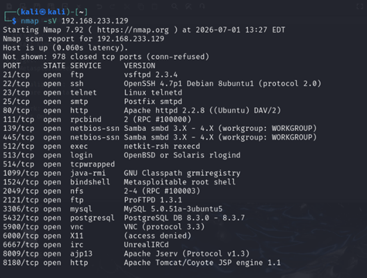
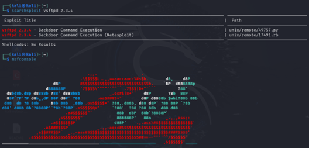
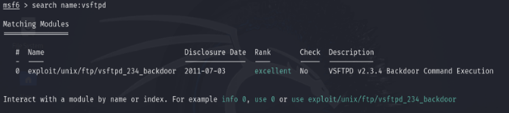
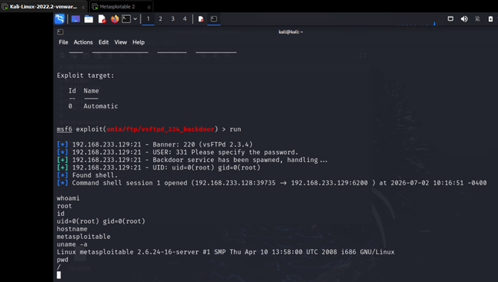

# Metasploitable2 VSFTPD Exploitation Lab

This project demonstrates a complete penetration testing workflow in a controlled lab environment using VMware, Kali Linux, and Metasploitable2. The assessment covers service enumeration, vulnerability identification, exploit validation, and successful exploitation of a vulnerable VSFTPD service using the Metasploit Framework.

---

# Lab Environment

| Component | Value |
|-----------|-------|
| Attacker | Kali Linux |
| Target | Metasploitable2 |
| Virtualization | VMware Workstation |
| Network | Host-Only |

---

# Service Enumeration

### Objective

Discover open ports and identify running services on the target machine.

### Tool

- Nmap

### Command

```bash
nmap -sV 192.168.233.129
```

### Results

Several network services were identified during the enumeration phase.

| Port | Service | Version | Priority |
|:----:|----------|---------|:--------:|
| 21 | FTP | vsftpd 2.3.4 | Very High |
| 22 | SSH | OpenSSH 4.7 | Medium |
| 80 | HTTP | Apache 2.2.8 | High |
| 139 | SMB | Samba | High |
| 445 | SMB | Samba | High |
| 3306 | MySQL | 5.0 | Medium |
| 5432 | PostgreSQL | 8.3 | Medium |

### Assessment

The FTP service was selected as the primary target because it was running an outdated version that could potentially have publicly documented vulnerabilities.

<div align="center">

</div>

---

# Vulnerability Identification

### Objective

Determine whether the detected FTP service has any publicly documented vulnerabilities.

### Tool

- SearchSploit

### Command

```bash
searchsploit vsftpd 2.3.4
```

### Results

SearchSploit identified publicly available exploits targeting **vsftpd 2.3.4**.

### Assessment

The presence of a public exploit made the FTP service the highest-priority candidate for further validation.

> **Note**
>
> The existence of a public exploit does **not** guarantee that the target system is vulnerable. Exploitation must still be validated.

<div align="center">

</div>

---

# Exploit Validation

### Objective

Verify that the Metasploit Framework contains a suitable exploit module for the identified FTP vulnerability.

### Tool

- Metasploit Framework

### Command

```text
search vsftpd
```

### Results

Metasploit contains an exploit module targeting **vsftpd 2.3.4**.

Module:

```
exploit/unix/ftp/vsftpd_234_backdoor
```

Rank:

```
Excellent
```

### Assessment

The availability of an official Metasploit module confirmed that the vulnerability could be tested in a reliable and repeatable manner.

<div align="center">

</div>

---

# Exploitation

### Objective

Exploit the vulnerable FTP service identified during the previous phases.

### Tool

- Metasploit Framework

### Module

```text
exploit/unix/ftp/vsftpd_234_backdoor
```

### Results

- Successfully exploited the vulnerable FTP service.
- Obtained a remote command shell.
- Verified **root** privileges using `whoami` and `id`.
- Confirmed successful access to the target system.

### Assessment

The exploitation phase confirmed that the FTP service was vulnerable to remote command execution, resulting in immediate root-level access to the target machine.

<div align="center">

</div>
